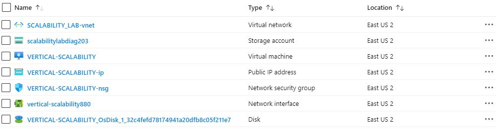
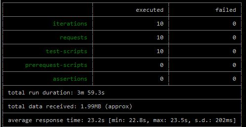

### Escuela Colombiana de Ingeniería
### Arquitecturas de Software - ARSW

## Escalamiento en Azure con Maquinas Virtuales, Sacale Sets y Service Plans

### Dependencias
* Cree una cuenta gratuita dentro de Azure. Para hacerlo puede guiarse de esta [documentación](https://azure.microsoft.com/en-us/free/search/?&ef_id=Cj0KCQiA2ITuBRDkARIsAMK9Q7MuvuTqIfK15LWfaM7bLL_QsBbC5XhJJezUbcfx-qAnfPjH568chTMaAkAsEALw_wcB:G:s&OCID=AID2000068_SEM_alOkB9ZE&MarinID=alOkB9ZE_368060503322_%2Bazure_b_c__79187603991_kwd-23159435208&lnkd=Google_Azure_Brand&dclid=CjgKEAiA2ITuBRDchty8lqPlzS4SJAC3x4k1mAxU7XNhWdOSESfffUnMNjLWcAIuikQnj3C4U8xRG_D_BwE). Al hacerlo usted contará con $200 USD para gastar durante 1 mes.

### Parte 0 - Entendiendo el escenario de calidad

Adjunto a este laboratorio usted podrá encontrar una aplicación totalmente desarrollada que tiene como objetivo calcular el enésimo valor de la secuencia de Fibonnaci.

**Escalabilidad**
Cuando un conjunto de usuarios consulta un enésimo número (superior a 1000000) de la secuencia de Fibonacci de forma concurrente y el sistema se encuentra bajo condiciones normales de operación, todas las peticiones deben ser respondidas y el consumo de CPU del sistema no puede superar el 70%.

### Parte 1 - Escalabilidad vertical

1. Diríjase a el [Portal de Azure](https://portal.azure.com/) y a continuación cree una maquina virtual con las características básicas descritas en la imágen 1 y que corresponden a las siguientes:
    * Resource Group = SCALABILITY_LAB
    * Virtual machine name = VERTICAL-SCALABILITY
    * Image = Ubuntu Server 
    * Size = Standard B1ls
    * Username = scalability_lab
    * SSH publi key = Su llave ssh publica


2. Para conectarse a la VM use el siguiente comando, donde las `x` las debe remplazar por la IP de su propia VM.

    `ssh scalability_lab@xxx.xxx.xxx.xxx`

3. Instale node, para ello siga la sección *Installing Node.js and npm using NVM* que encontrará en este [enlace](https://linuxize.com/post/how-to-install-node-js-on-ubuntu-18.04/).
4. Para instalar la aplicación adjunta al Laboratorio, suba la carpeta `FibonacciApp` a un repositorio al cual tenga acceso y ejecute estos comandos dentro de la VM:

    `git clone <your_repo>`

    `cd <your_repo>/FibonacciApp`

    `npm install`

5. Para ejecutar la aplicación puede usar el comando `npm FibinacciApp.js`, sin embargo una vez pierda la conexión ssh la aplicación dejará de funcionar. Para evitar ese compartamiento usaremos *forever*. Ejecute los siguientes comando dentro de la VM.

    `npm install forever -g`

    `forever start FibinacciApp.js`

6. Antes de verificar si el endpoint funciona, en Azure vaya a la sección de *Networking* y cree una *Inbound port rule* tal como se muestra en la imágen. Para verificar que la aplicación funciona, use un browser y user el endpoint `http://xxx.xxx.xxx.xxx:3000/fibonacci/6`. La respuesta debe ser `The answer is 8`.


7. La función que calcula en enésimo número de la secuencia de Fibonacci está muy mal construido y consume bastante CPU para obtener la respuesta. Usando la consola del Browser documente los tiempos de respuesta para dicho endpoint usando los siguintes valores:
    * 1000000
    * 1010000
    * 1020000
    * 1030000
    * 1040000
    * 1050000
    * 1060000
    * 1070000
    * 1080000
    * 1090000    

8. Dírijase ahora a Azure y verifique el consumo de CPU para la VM. (Los resultados pueden tardar 5 minutos en aparecer).


9. Ahora usaremos Postman para simular una carga concurrente a nuestro sistema. Siga estos pasos.
    * Instale newman con el comando `npm install newman -g`. Para conocer más de Newman consulte el siguiente [enlace](https://learning.getpostman.com/docs/postman/collection-runs/command-line-integration-with-newman/).
    * Diríjase hasta la ruta `FibonacciApp/postman` en una maquina diferente a la VM.
    * Para el archivo `[ARSW_LOAD-BALANCING_AZURE].postman_environment.json` cambie el valor del parámetro `VM1` para que coincida con la IP de su VM.
    * Ejecute el siguiente comando.

    ```
    newman run ARSW_LOAD-BALANCING_AZURE.postman_collection.json -e [ARSW_LOAD-BALANCING_AZURE].postman_environment.json -n 10 &
    newman run ARSW_LOAD-BALANCING_AZURE.postman_collection.json -e [ARSW_LOAD-BALANCING_AZURE].postman_environment.json -n 10
    ```

10. La cantidad de CPU consumida es bastante grande y un conjunto considerable de peticiones concurrentes pueden hacer fallar nuestro servicio. Para solucionarlo usaremos una estrategia de Escalamiento Vertical. En Azure diríjase a la sección *size* y a continuación seleccione el tamaño `B2ms`.


11. Una vez el cambio se vea reflejado, repita el paso 7, 8 y 9.
12. Evalue el escenario de calidad asociado al requerimiento no funcional de escalabilidad y concluya si usando este modelo de escalabilidad logramos cumplirlo.
13. Vuelva a dejar la VM en el tamaño inicial para evitar cobros adicionales.

**Preguntas**

1. ¿Cuántos y cuáles recursos crea Azure junto con la VM?

- Crea los siguientes recursos 


2. ¿Brevemente describa para qué sirve cada recurso?
- **Virtual Network:** Azure Virtual Network (VNet) es el bloque de creación fundamental de una red privada en Azure. VNet permite muchos tipos de recursos de Azure, como Azure Virtual Machines (máquinas virtuales), para comunicarse de forma segura entre usuarios, con Internet y con las redes locales.
- **Storage account:** Azure Storage es un servicio administrado por Microsoft que proporciona almacenamiento en la nube altamente disponible, seguro, duradero, escalable y redundante. 
- **Virtual machine:** es un software que simula un sistema de computación y puede ejecutar programas como si fuese una computadora real.
- **Public Ip address:** Una dirección IP pública es una dirección IP dinámica o estática que puede asignar a máquinas virtuales, equilibradores de carga y puertas de enlace de red virtual para comunicarse con Internet. Sus direcciones IP públicas están asociadas con su suscripción de Azure y se pueden mover libremente entre los recursos de Azure.
- **Network security group:** Un grupo de seguridad de red es una capa de seguridad que actúa como un firewall virtual para controlar el tráfico de entrada y salida de máquinas virtuales (a través de interfaces de red) y subredes. Contiene un conjunto de reglas de seguridad que permiten o niegan el tráfico entrante y saliente utilizando las siguientes 5 tuplas: protocolo, rango de dirección IP de origen, rango de puerto de origen, rango de dirección IP de destino y rango de puerto de destino.
- **Network interface:** Las interfaces de red se utilizan para configurar direcciones IP, configuraciones de red virtual y servidores DNS que se asignarán a una máquina virtual. Microsoft Azure admite la conexión de múltiples interfaces de red (NIC) a una máquina virtual para una flexibilidad adicional en las opciones de conectividad de red.
- **Disk:** Cada máquina virtual de Azure está conectada a al menos un disco para el sistema operativo y el almacenamiento persistente. Un disco puede ser una unidad estándar (HDD) o premium (SSD). Los discos creados con este método solo se pueden usar con máquinas virtuales clásicas.

3. ¿Al cerrar la conexión ssh con la VM, por qué se cae la aplicación que ejecutamos con el comando `npm FibonacciApp.js`? ¿Por qué debemos crear un *Inbound port rule* antes de acceder al servicio?


4. Adjunte tabla de tiempos e interprete por qué la función tarda tando tiempo.

    

5. Adjunte imágen del consumo de CPU de la VM e interprete por qué la función consume esa cantidad de CPU.


6. Adjunte la imagen del resumen de la ejecución de Postman. Interprete:

    * Tiempos de ejecución de cada petición.
    * Si hubo fallos documentelos y explique.
    
    
    
    
    

7. ¿Cuál es la diferencia entre los tamaños `B2ms` y `B1ls` (no solo busque especificaciones de infraestructura)?
- **B1ls:**
    * RAM 0.5
- **B2ms:** 
    * RAM 8
8. ¿Aumentar el tamaño de la VM es una buena solución en este escenario?, ¿Qué pasa con la FibonacciApp cuando cambiamos el tamaño de la VM?

    Produjo una disminucion en el consumo de cpu al momento del proceso de las peticiones, pero sigue con el mismo tiempo de ejecucion

9. ¿Qué pasa con la infraestructura cuando cambia el tamaño de la VM? ¿Qué efectos negativos implica?

    Se reinicia la maquina en el proceso que se cambia el tamaño de la VM, dejando sin servicio la aplicacion

10. ¿Hubo mejora en el consumo de CPU o en los tiempos de respuesta? Si/No ¿Por qué?

    Hubo mejora en el consumo de la CPU haciendo que consumiera menos pero los tiempos de respuesta seguian igual.

11. Aumente la cantidad de ejecuciones paralelas del comando de postman a `4`. ¿El comportamiento del sistema es porcentualmente mejor?


### Parte 2 - Escalabilidad horizontal

#### Crear el Balanceador de Carga

Antes de continuar puede eliminar el grupo de recursos anterior para evitar gastos adicionales y realizar la actividad en un grupo de recursos totalmente limpio.

1. El Balanceador de Carga es un recurso fundamental para habilitar la escalabilidad horizontal de nuestro sistema, por eso en este paso cree un balanceador de carga dentro de Azure tal cual como se muestra en la imágen adjunta.


2. A continuación cree un *Backend Pool*, guiese con la siguiente imágen.


3. A continuación cree un *Health Probe*, guiese con la siguiente imágen.


4. A continuación cree un *Load Balancing Rule*, guiese con la siguiente imágen.


5. Cree una *Virtual Network* dentro del grupo de recursos, guiese con la siguiente imágen.


#### Crear las maquinas virtuales (Nodos)

Ahora vamos a crear 3 VMs (VM1, VM2 y VM3) con direcciones IP públicas standar en 3 diferentes zonas de disponibilidad. Después las agregaremos al balanceador de carga.

1. En la configuración básica de la VM guíese por la siguiente imágen. Es importante que se fije en la "Avaiability Zone", donde la VM1 será 1, la VM2 será 2 y la VM3 será 3.


2. En la configuración de networking, verifique que se ha seleccionado la *Virtual Network*  y la *Subnet* creadas anteriormente. Adicionalmente asigne una IP pública y no olvide habilitar la redundancia de zona.


3. Para el Network Security Group seleccione "avanzado" y realice la siguiente configuración. No olvide crear un *Inbound Rule*, en el cual habilite el tráfico por el puerto 3000. Cuando cree la VM2 y la VM3, no necesita volver a crear el *Network Security Group*, sino que puede seleccionar el anteriormente creado.


4. Ahora asignaremos esta VM a nuestro balanceador de carga, para ello siga la configuración de la siguiente imágen.


5. Finalmente debemos instalar la aplicación de Fibonacci en la VM. para ello puede ejecutar el conjunto de los siguientes comandos, cambiando el nombre de la VM por el correcto

```
git clone https://github.com/daprieto1/ARSW_LOAD-BALANCING_AZURE.git

curl -o- https://raw.githubusercontent.com/creationix/nvm/v0.34.0/install.sh | bash
source /home/vm1/.bashrc
nvm install node

cd ARSW_LOAD-BALANCING_AZURE/FibonacciApp
npm install

npm install forever -g
forever start FibonacciApp.js
```

Realice este proceso para las 3 VMs, por ahora lo haremos a mano una por una, sin embargo es importante que usted sepa que existen herramientas para aumatizar este proceso, entre ellas encontramos Azure Resource Manager, OsDisk Images, Terraform con Vagrant y Paker, Puppet, Ansible entre otras.

#### Probar el resultado final de nuestra infraestructura

1. Porsupuesto el endpoint de acceso a nuestro sistema será la IP pública del balanceador de carga, primero verifiquemos que los servicios básicos están funcionando, consuma los siguientes recursos:

```
http://52.155.223.248/
http://52.155.223.248/fibonacci/1
```

2. Realice las pruebas de carga con `newman` que se realizaron en la parte 1 y haga un informe comparativo donde contraste: tiempos de respuesta, cantidad de peticiones respondidas con éxito, costos de las 2 infraestrucruras, es decir, la que desarrollamos con balanceo de carga horizontal y la que se hizo con una maquina virtual escalada.

- Tablas de tiempo con 2 en paralelo

    
    

- Rendimiento de CPU 

    * MV1 
    
        

    * MV2 
    
        

    * MV3
    
        


3. Agregue una 4 maquina virtual y realice las pruebas de newman, pero esta vez no lance 2 peticiones en paralelo, sino que incrementelo a 4. Haga un informe donde presente el comportamiento de la CPU de las 4 VM y explique porque la tasa de éxito de las peticiones aumento con este estilo de escalabilidad.

```
newman run ARSW_LOAD-BALANCING_AZURE.postman_collection.json -e [ARSW_LOAD-BALANCING_AZURE].postman_environment.json -n 10 &
newman run ARSW_LOAD-BALANCING_AZURE.postman_collection.json -e [ARSW_LOAD-BALANCING_AZURE].postman_environment.json -n 10 &
newman run ARSW_LOAD-BALANCING_AZURE.postman_collection.json -e [ARSW_LOAD-BALANCING_AZURE].postman_environment.json -n 10 &
newman run ARSW_LOAD-BALANCING_AZURE.postman_collection.json -e [ARSW_LOAD-BALANCING_AZURE].postman_environment.json -n 10
```
- Tablas de tiempo con 4 en paralelo




- Rendimiento de CPU 

    * MV1 
    
        

    * MV2 
    
        

    * MV3
    
        

    * MV4
    
        

**Preguntas**

* ¿Cuáles son los tipos de balanceadores de carga en Azure y en qué se diferencian?, ¿Qué es SKU, qué tipos hay y en qué se diferencian?, ¿Por qué el balanceador de carga necesita una IP pública?
    * **Simplify load balancing for applications:** Con el equilibrio de carga incorporado para servicios en la nube y máquinas virtuales, puede crear aplicaciones altamente disponibles y escalables en minutos. Azure Load Balancer admite protocolos basados ​​en TCP / UDP como HTTP, HTTPS y SMTP, y protocolos utilizados para aplicaciones de mensajería de voz y video en tiempo real.
    * **Internal load balancer:** Use el equilibrador de carga interno para el tráfico entre máquinas virtuales dentro de sus redes virtuales privadas, o úselo para crear aplicaciones híbridas de varios niveles.

* ¿Cuál es el propósito del *Backend Pool*?

     se refiere al conjunto de backends que reciben tráfico similar para su aplicación. En otras palabras, es una agrupación lógica de sus instancias de aplicaciones en todo el mundo que reciben el mismo tráfico y responden con el comportamiento esperado.

* ¿Cuál es el propósito del *Health Probe*?

    permite que el Load Balancer detecte el estado del punto final del back-end. La configuración de la health probe y las respuestas de la sonda determinan qué instancias de grupo de back-end recibirán nuevos flujos.

* ¿Cuál es el propósito de la *Load Balancing Rule*? ¿Qué tipos de sesión persistente existen, por qué esto es importante y cómo puede afectar la escalabilidad del sistema?.
    * Una regla de equilibrador de carga define la configuración de IP de interfaz para el tráfico entrante y el grupo de back-end para recibir el tráfico, junto con el puerto de origen y destino requerido.
    * Proporciona equilibrio de carga entrante y la regla de salida controla el NAT saliente proporcionado para la VM. Este inicio rápido utiliza dos grupos de backend separados, uno para entrada y otro para salida, para ilustrar la capacidad y permitir flexibilidad para este escenario.

* ¿Qué es una *Virtual Network*? ¿Qué es una *Subnet*? ¿Para qué sirven los *address space* y *address range*?

    * **Virtual Network:** Sirve para comunicarse de forma segura entre usuarios, con Internet y con las redes locales.
    * **Subnet:**  le permiten segmentar la red virtual en una o más subredes y asignar una parte del espacio de direcciones de la red virtual a cada subred. Luego puede implementar recursos de Azure en una subred específica.
    * **address space:** al crear una red virtual, debe especificar un espacio de direcciones IP privadas personalizadas utilizando direcciones públicas y privadas (RFC 1918). Azure asigna recursos en una red virtual a una dirección IP privada desde el espacio de direcciones que asigne. 
    * **address range:** El rango de direcciones que defina puede ser público o privado (RFC 1918). Ya sea que defina el rango de direcciones como público o privado, solo se puede acceder al rango de direcciones desde la red virtual, desde redes virtuales interconectadas y desde cualquier red local que haya conectado a la red virtual.

* ¿Qué son las *Availability Zone* y por qué seleccionamos 3 diferentes zonas?. ¿Qué significa que una IP sea *zone-redundant*?

    * **Availability Zone:** es una oferta de alta disponibilidad que protege sus aplicaciones y datos de fallas en el centro de datos. Las zonas de disponibilidad son ubicaciones físicas únicas dentro de una región de Azure. Cada zona está compuesta por uno o más centros de datos equipados con alimentación, refrigeración y redes independientes. 
    * **zone-redundant:** replican sus aplicaciones y datos en zonas de disponibilidad para protegerlos de puntos únicos de falla.


* ¿Cuál es el propósito del *Network Security Group*?

    * **Network Security Group:** es una capa de seguridad que actúa como un firewall virtual para controlar el tráfico de entrada y salida de máquinas virtuales (a través de interfaces de red) y subredes. Contiene un conjunto de reglas de seguridad que permiten o niegan el tráfico entrante y saliente utilizando las siguientes 5 tuplas: protocolo, rango de dirección IP de origen, rango de puerto de origen, rango de dirección IP de destino y rango de puerto de destino.

* Informe de newman 1 (Punto 2)


* Presente el Diagrama de Despliegue de la solución.


